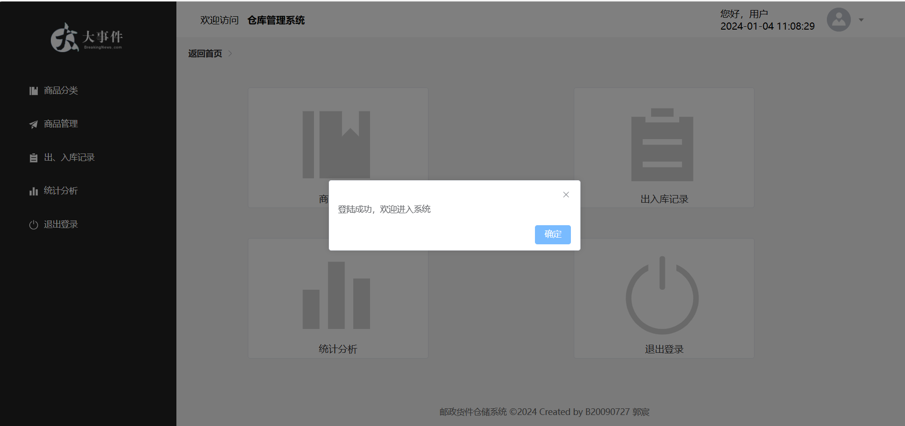
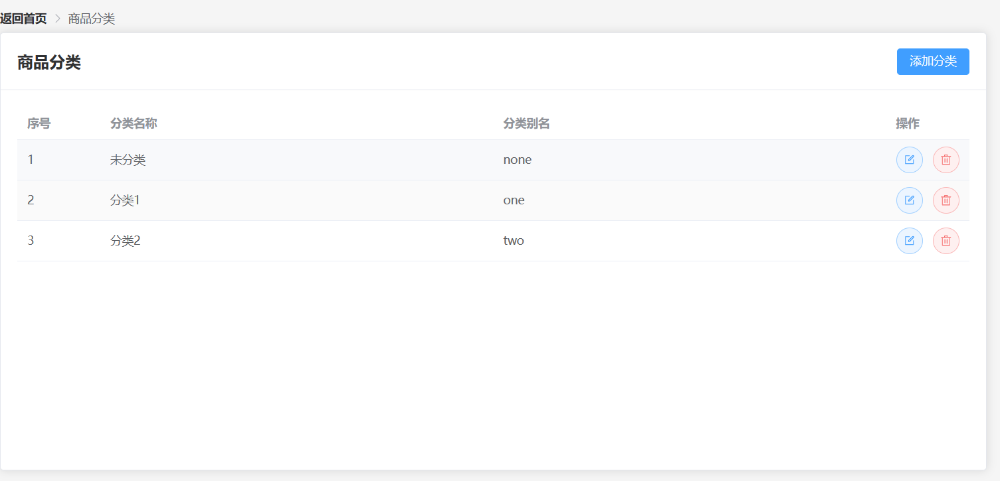

# 邮政货件仓储系统

## 1. 项目设计

### 1.1 设计要求

设计一套仓储管理系统，实现邮政货件的入库、出库、盘点、预警管理、报表管理等功能。

要求：

•1）实现管理系统信息关系的系统化、规范化和自动化；

•2）管理系统可设置预警规则并自动报警；

•3）设计仓储需求历史数据，并根据历史数据开发仓储需求预测程序，实现未来需求预测。

### 1.2 实现功能

在本系统中，用户可以登录（作弊用户名：`Ele001` 密码任意）后对仓库系统进行分类管理、商品管理、商品预警规则设计、商品需求预测等功能，界面大致如下所示：

登录界面：

注册窗口：

登录进入：

商品分类：

商品管理：

出入库记录：

统计分析：

